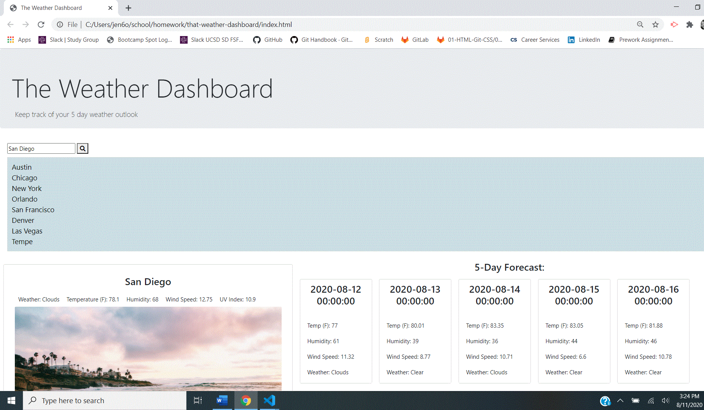

# that-weather-dashboard
This project seeks to deliver a simple weather dashboard that leverages the OpenWeather API to retrieve weather data for cities.
When users search for a city, they are presented with a 5 day weather forecast and the UI displays pertinent weather information for that city, including a UV index with a color indicator informing the user whether conditions are favorable, moderate or severe. 

The city is then added to the search history, allowing the user to revist past searches.

## User Story
As a traveler, I want to see the weather outlook for multiple cities so that I can plan for a trip accordingly. 

## Preview

## Deployed Site Link
Here's the link to my app: https://jen6one9.github.io/that-weather-dashboard/

## Acknowledgements
This successful launch of this application was made possible through the support of my tutor and cohort peers. In addition, I would to acknowledge Erik for his eagle eyes and solid feedback as well as @MontyLov photo from unsplash.com. 

This application makes use of the following third party library: Unsplash.com.
Unsplash photos are made to be used freely. Our license reflects that.
All photos can be downloaded and used for free
Commercial and non-commercial purposes
No permission needed (though attribution is appreciated!)
What is not permitted:
    Photos cannot be sold or redistributed without significant modification.
    Compiling photos from Unsplash to replicate a similar or competing service.

Unsplash grants you an irrevocable, nonexclusive, worldwide copyright license to download, copy, modify, distribute, perform, and use photos from Unsplash for free, including for commercial purposes, without permission from or attributing the photographer or Unsplash. This license does not include the right to compile photos from Unsplash to replicate a similar or competing service.

## License
Copyright 2020 Jeneth Diesta

Permission is hereby granted, free of charge, to any person obtaining a copy of this software and associated documentation files (the "Software"), to deal in the Software without restriction, including without limitation the rights to use, copy, modify, merge, publish, distribute, sublicense, and/or sell copies of the Software, and to permit persons to whom the Software is furnished to do so, subject to the following conditions:

The above copyright notice and this permission notice shall be included in all copies or substantial portions of the Software.

THE SOFTWARE IS PROVIDED "AS IS", WITHOUT WARRANTY OF ANY KIND, EXPRESS OR IMPLIED, INCLUDING BUT NOT LIMITED TO THE WARRANTIES OF MERCHANTABILITY, FITNESS FOR A PARTICULAR PURPOSE AND NONINFRINGEMENT. IN NO EVENT SHALL THE AUTHORS OR COPYRIGHT HOLDERS BE LIABLE FOR ANY CLAIM, DAMAGES OR OTHER LIABILITY, WHETHER IN AN ACTION OF CONTRACT, TORT OR OTHERWISE, ARISING FROM, OUT OF OR IN CONNECTION WITH THE SOFTWARE OR THE USE OR OTHER DEALINGS IN THE SOFTWARE.

